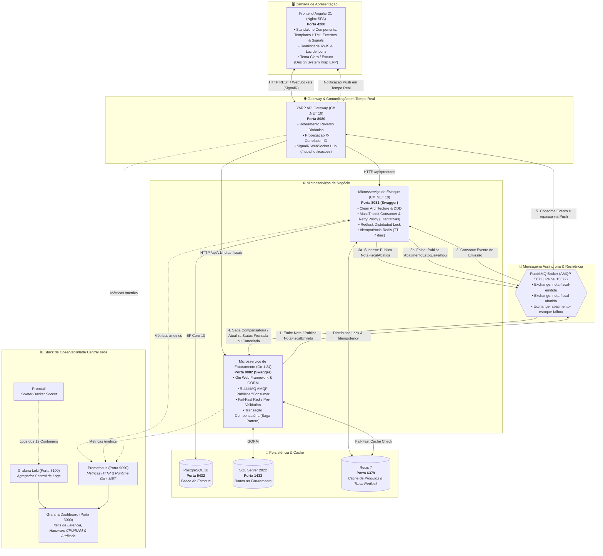

# 📦 Korp_Teste_Paulo - Sistema de Emissão de Notas Fiscais e Gestão de Estoque

Este repositório contém a solução completa para o desafio técnico da **Korp**, desenvolvida em uma arquitetura de microsserviços poliglota altamente resiliente com **Angular 21 (Standalone Components & Signals)**, **C# (.NET 10)**, **Go (Golang 1.24)**, **YARP API Gateway**, **SignalR WebSockets**, **RabbitMQ**, **Redis**, **PostgreSQL** e **SQL Server**.

---

## 🏛️ Visão Geral da Arquitetura

O sistema foi desenhado seguindo os princípios de **Clean Architecture**, **Domain-Driven Design (DDD)**, **Event-Driven Architecture (EDA)**, **API Gateway Pattern**, **Saga Pattern (Transação Compensatória)**, **MassTransit Retry Policy** e **Observabilidade Distribuída**:



---

## 📋 Respostas ao Detalhamento Técnico (Especificação Korp - PDF)

Esta seção atende de forma explícita e aprofundada a todas as perguntas e requisitos do documento de especificação técnica do teste (`c_ou_go_+_angular.pdf`):

---

### 1. Quais ciclos de vida do Angular foram utilizados?

Na aplicação Frontend (desenvolvida na versão mais recente do **Angular**, utilizando arquitetura de **Standalone Components**, **Signals** e separação total de templates em arquivos `.component.html` externos):

- **`ngOnInit`**: Utilizado para inicializar o estado dos componentes visuais, disparar as cargas reativas de dados iniciais (`carregarNotas()`, `carregarProdutos()`), subscrever a eventos assíncronos e registrar a escuta de eventos push do **SignalR WebSocket**.
- **`ngOnDestroy` e `DestroyRef` (`takeUntilDestroyed`)**:
  - Utilizado no `SignalRService` para realizar o encerramento gracioso (*graceful shutdown*) da conexão WebSocket com o Hub do API Gateway (`stopConnection()`) quando o serviço for destruído.
  - Utilizado nos componentes de listagem e formulários através da injeção de `DestroyRef` combinada com o operador reativo moderno `takeUntilDestroyed(this.destroyRef)` do Angular, garantindo o cancelamento automático de subscrições aos Observables do RxJS e prevenindo vazamentos de memória (*memory leaks*).
- **Separação Rigorosa de Arquivos HTML (`templateUrl`)**: Todos os 9 componentes Angular possuem arquivos `.component.html` e `.component.scss` dedicados, mantendo as classes TypeScript focadas exclusivamente na lógica de apresentação e gerenciamento de estado.
- **Angular Signals & Modern Control Flow**: A aplicação adota a nova reatividade de alta performance do Angular com `signal()`, `computed()` e a sintaxe declarativa de fluxo de controle `@if`, `@for (track item.id)` e `@else`, eliminando a necessidade de diretivas legadas (`*ngIf`, `*ngFor`) e otimizando a detecção de mudanças.

---

### 2. Se foi feito uso da biblioteca RxJS e, em caso afirmativo, como?

**SIM**, a biblioteca **RxJS** foi utilizada de forma extensiva e estratégica em todo o ciclo de comunicação reativa do frontend:

- **Desacoplamento de Eventos em Tempo Real (`Subject` e `Observable`)**: No `SignalRService`, foram criados instâncias privadas de `Subject<T>` (`notaFiscalAbatidaSubject` e `abatimentoEstoqueFalhouSubject`) expostas publicamente como Observables somente leitura (`notaFiscalAbatida$` e `abatimentoEstoqueFalhou$`), desacoplando a camada de transporte de rede WebSocket dos componentes visuais da interface.
- **Tratamento Centralizado de Erros (`catchError` e `throwError`)**: Utilizado no `errorInterceptor` global para interceptar respostas HTTP com falha (`HttpErrorResponse`), desmembrar contratos RFC 7807 (`ProblemDetails` e `ValidationProblemDetails`), extrair o `X-Correlation-ID` e propagar a notificação amigável para o `ToastService`.
- **Transformação e Normalização de Dados (`tap` e `map`)**: Utilizado nos serviços `NotaFiscalService` e `ProdutoService` para interceptar as respostas da API de Faturamento em Go (que encapsula os dados em envelopes `{ success: true, data: [...] }`) e unificar a conversão transparente entre propriedades em `snake_case` e `camelCase`.
- **Gerenciamento do Ciclo de Vida Reativo (`takeUntilDestroyed`)**: Aplicado nos pipes de subscrição dos componentes para desinscrever automaticamente dos fluxos assim que o componente for destruído.

---

### 3. Quais outras bibliotecas foram utilizadas e para qual finalidade?

#### No Frontend (Angular):
1. **`@microsoft/signalr` (^10.0.11)**: Cliente oficial de WebSockets do ASP.NET Core SignalR para estabelecer conexão full-duplex e persistente com o API Gateway (`ws://localhost:8080/hubs/notificacoes`), fornecendo reconexão automática resiliente com *exponential backoff* (`[0, 2000, 5000, 10000, 30000] ms`).
2. **`lucide-angular` / `@lucide/angular`**: Biblioteca de ícones vetoriais SVG leves, consistentes e modernos, utilizada em toda a interface (Navbar, Cards, Tabelas de Produtos e Notas, Badges de Status e Toasts).
3. **`@angular/forms` (`ReactiveFormsModule`, `FormBuilder`, `FormArray`, `Validators`)**: Construção de formulários reativos tipados, validações instantâneas de campos obrigatórios e criação dinâmica de múltiplos itens com quantidades em uma mesma nota fiscal através do `FormArray`.
4. **`@angular/router`**: Gerenciamento de navegação cliente (SPA) com rotas standalone e lazy loading.
5. **`@angular/common`**: Diretivas e pipes de formatação monetária brasileira (`CurrencyPipe` para `BRL R$`), formatação de texto e datas.
6. **`vitest` & `jsdom`**: Framework moderno de testes unitários ultrarrápido configurado para a validação da camada de componentes e serviços do frontend.

#### No Backend & Infraestrutura:
- **`MassTransit.RabbitMQ` & `amqp091-go`**: Orquestração, mensageria e publicação de eventos de domínio no RabbitMQ.
- **`StackExchange.Redis` & `RedLock.net`**: Controle de travas distribuídas (*Distributed Lock*) e verificação de idempotência.
- **`go-redis/v9`**: Cliente de cache de alta performance no Go para validação *Fail-Fast* de produtos.
- **`FluentValidation`**: Validação de contratos e regras de negócio com retorno RFC 7807 (`ProblemDetails`).
- **`Yarp.ReverseProxy`**: API Gateway de alta performance para proxy reverso dinâmico e injeção do cabeçalho `X-Correlation-ID`.
- **`prometheus-net` & `client_golang`**: Exportadores de métricas HTTP e runtime para coleta no Prometheus.
- **`Serilog` & `log/slog`**: Logging estruturado em formato JSON com envio automatizado ao Grafana Loki.
- **`Newman CLI` & `Grafana k6`**: Ferramentas automatizadas para suítes de testes E2E e testes de estresse/carga.

---

### 4. Para componentes visuais, quais bibliotecas foram utilizadas?

- **Design System Customizado em SCSS com Glassmorphism Moderno**:
  - Em vez de utilizar bibliotecas de componentes genéricas e pesadas, foi desenvolvido um **Design System proprietário e completo em SCSS**, alinhado com a identidade visual e as cores oficiais da **KORP ERP**:
    - **Vermelho Primário KORP:** `#E60039`
    - **Azul Marinho Corporativo:** `#1E3A52`
    - **Aço Cerúleo:** `#6B93B1`
    - **Grafite Sofisticado:** `#36383A`
  - **Efeitos Visuais de Alto Padrão:** Efeito *Glassmorphism* com `backdrop-filter: blur(12px)`, bordas translúcidas, sombras suaves e micro-animações interativas de hover e loading (`mini-spinner`).
  - **Modo Claro (Light Mode) e Modo Escuro (Dark Mode):** Suporte nativo com persistência de preferências em `localStorage` e alternância suave no Navbar via `ThemeService`.
  - **Componentes Visuais Modulares:**
    - *Dashboard de KPIs*: Contadores estatísticos com atualização em tempo real de produtos e faturamento.
    - *Formulários em Cards*: Inclusão intuitiva de múltiplos itens com totalizadores em tempo real e desativação inteligente de produtos já adicionados.
    - *Tabelas Responsivas com Expansão*: Exibição de notas fiscais com linhas sanfonadas para detalhamento dos itens, motivos de cancelamento formatados com marcadores (`•`) e badges de status coloridos.
    - *Sistema Central de Toasts (`ToastService` / `ToastContainerComponent`)*: Notificações push flutuantes para sucesso, aviso, erro de validação e alertas de transação compensatória com exibição do Correlation ID.

---

### 5. Como foi realizado o gerenciamento de dependências no Golang?

O gerenciamento de dependências no microsserviço de **Faturamento** foi realizado através do **Go Modules** (`go.mod` e `go.sum`):
- O arquivo `go.mod` declara o módulo (`faturamento-api`), a versão alvo do Go (`go 1.24`) e todas as dependências diretas e indiretas com hashes criptográficos imutáveis registrados no `go.sum`.
- Permite compilação determinística e builds reproduzíveis em múltiplos estágios dentro do container Docker (`golang:1.24-alpine` para compilação e `alpine:latest` para produção, gerando imagens com menos de 30 MB).
- Comandos utilizados no ciclo de desenvolvimento: `go mod tidy`, `go mod download` e `go test ./...`.

---

### 6. Quais frameworks foram utilizados no Golang ou C#?

#### 🌐 API Gateway (C# .NET 10):
- **YARP (Yet Another Reverse Proxy - `Yarp.ReverseProxy` 2.3.0)**: Roteamento inteligente de requisições, balanceamento e propagação do cabeçalho `X-Correlation-ID`.
- **ASP.NET Core SignalR (`Microsoft.AspNetCore.SignalR`)**: Servidor de WebSockets para notificações push em tempo real para o Frontend.
- **MassTransit 8.3.6 (`MassTransit.RabbitMQ`)**: Consumo de eventos de integração do RabbitMQ e disparo imediato de notificações no Hub SignalR.
- **NetArchTest.Rules**: *Fitness Functions* automatizadas garantindo convenções de Consumers, Hubs, Middlewares e limites de arquitetura.

#### 🔵 Microsserviço de Estoque (C# .NET 10):
- **ASP.NET Core 10 Web API**: Framework base de desenvolvimento de APIs REST de alto desempenho.
- **Entity Framework Core 10 (`Npgsql.EntityFrameworkCore.PostgreSQL`)**: ORM de persistência no PostgreSQL com suporte a Migrations automáticas na inicialização.
- **MassTransit 8.3.6**: Consumo assíncrono do evento `NotaFiscalEmitidaEvent`, suporte a **Política de Retry (3 tentativas em exceções transitórias de lock)** e publicação de eventos de sucesso (`NotaFiscalAbatidaEvent`) ou falha (`AbatimentoEstoqueFalhouEvent`).
- **StackExchange.Redis & RedLock.net 2.3.2**: Gerenciamento de trava distribuída (*Distributed Lock*) e controle de idempotência.
- **FluentValidation 12**: Validação de regras e contratos de entrada.
- **NetArchTest.Rules**: *Fitness Functions* automatizadas garantindo os limites arquiteturais do DDD e Clean Architecture.

#### 🟢 Microsserviço de Faturamento (Golang):
- **Gin Web Framework (`github.com/gin-gonic/gin`)**: Roteador HTTP de alta performance e middlewares REST.
- **GORM (`gorm.io/gorm` com `gorm.io/driver/sqlserver`)**: ORM para mapeamento objeto-relacional e persistência no banco de dados **SQL Server 2022**.
- **RabbitMQ AMQP 0-9-1 Client (`github.com/rabbitmq/amqp091-go`)**: Publicação de notas fiscais emitidas e consumo de eventos de resposta (Saga compensatória).
- **Go-Redis Client (`github.com/redis/go-redis/v9`)**: Cache distribuído para validação rápida (*Fail-Fast*) de produtos.
- **Swaggo (`swaggo/swag` & `gin-swagger`)**: Geração automática de documentação Swagger / OpenAPI interativa.
- **AST Architecture Analyzer (`go/parser` & `go/ast`)**: *Fitness Functions* nativas em Go validando os limites de arquitetura limpa (independência do Domain, desacoplamento de repositórios e mensageria).

---

### 7. Como foram tratados os erros e exceções no backend?

A solução adota uma estratégia em camadas para tratamento de erros síncronos e assíncronos:

#### Tratamento Síncrono (HTTP REST):
- **No C# (Estoque e Gateway)**:
  - **`ExceptionHandlingMiddleware`**: Intercepta exceções globais não tratadas e formata a resposta no padrão **RFC 7807** (`ProblemDetails` com código de status HTTP 500).
  - **FluentValidation + `ValidationProblemDetails`**: Se o payload de cadastro de produto contiver dados inválidos (ex: código vazio, descrição longa ou saldo negativo), retorna imediatamente `HTTP 400 Bad Request` com a lista estruturada de erros por campo.
- **No Golang (Faturamento)**:
  - **Tratamento Idiomático Explícito**: Todo ponto crítico valida retornos com `if err != nil`, logando com `slog` em JSON estruturado e devolvendo envelopes `{ "success": false, "error": { "code": "...", "message": "..." } }`.
  - **Fail-Fast Cache Pre-Validation**: Antes de abrir transação no SQL Server para criar a nota fiscal, o serviço consulta o Redis (`produto:codigo:{codigo}`). Caso o produto não exista no catálogo, o Faturamento rejeita a requisição imediatamente com `HTTP 400 Bad Request` em sub-milissegundos.

#### Tratamento de Falhas Assíncronas e Resiliência (Requisito Obrigatório #2 do PDF):
1. **Política de Retentativas MassTransit (3 tentativas de Lock Redlock)**:
   - No consumidor C# (`NotaFiscalEmitidaConsumer`), erros transitórios de obtenção de trava distribuída no Redis disparam um re-throw (`throw`) controlado quando `GetRetryCount() < 3`.
   - O MassTransit re-executa a tentativa até 3 vezes com *backoff* antes de descartar a mensagem ou mover para a Dead Letter Queue (`_error`).
2. **Cenário de Falha de Negócio (Saldo Insuficiente de Estoque)**:
   - Ao consumir o evento de emissão, se o estoque PostgreSQL constatar saldo insuficiente, publica-se o evento **`AbatimentoEstoqueFalhouEvent`**.
   - O Faturamento consome este evento e executa a **Transação Compensatória (Saga Pattern)**, alterando o status no SQL Server para `"Cancelada"` e gravando o motivo detalhado em `motivo_cancelamento`.
   - O API Gateway envia uma notificação push via **SignalR WebSocket (`/hubs/notificacoes`)** para o Angular, que exibe o Toast de erro com o motivo formatado em marcadores.
3. **Cenário de Queda de Infraestrutura (Microsserviço de Estoque Indisponível)**:
   - Se o container `estoque-api` estiver offline, a mensagem permanece armazenada de forma durável nas filas do **RabbitMQ**. Ao retornar, o Estoque consome os eventos acumulados com garantia de idempotência.

---

### 8. Caso a implementação utilize C#, indicar se foi utilizado LINQ e de que forma:

**SIM**, o LINQ (*Language Integrated Query*) foi utilizado amplamente no microsserviço de Estoque em 5 cenários indispensáveis:

1. **Prevenção de Deadlock na Trava Distribuída (Redlock)**:
   ```csharp
   var produtosOrdenados = message.Itens
       .OrderBy(i => i.CodigoProduto)
       .ToList();
   ```
   *Garante que múltiplas threads e nós distribuídos sempre adquiram os locks na mesma ordem alfabética de chave, prevenindo travamentos mútuos (deadlocks).*
2. **Agrupamento e Agregação de Quantidades por Produto**:
   ```csharp
   var quantidadesPorProduto = message.Itens
       .GroupBy(i => i.CodigoProduto)
       .ToDictionary(g => g.Key, g => g.Sum(x => x.Quantidade));
   ```
   *Consolida itens repetidos da mesma nota somando suas quantidades para realizar um único débito atômico por produto.*
3. **Filtros Dinâmicos de Consulta no EF Core**:
   ```csharp
   query = query.Where(p => p.Codigo.Contains(busca) || p.Descricao.Contains(busca));
   ```
4. **Projeções de Mapeamento DTO**:
   ```csharp
   var dtos = await query
       .Select(p => new ProdutoResponseDto(p.Codigo, p.Descricao, p.Saldo))
       .ToListAsync(cancellationToken);
   ```
5. **Validações Assíncronas de Existência**:
   ```csharp
   var existe = await _context.Produtos.AnyAsync(p => p.Codigo == codigo, cancellationToken);
   ```

---

## 🌟 Requisitos Opcionais Implementados (Especificação PDF - Pág. 2)

- **a. Tratamento de Concorrência**:
  - Implementado através do algoritmo de **Distributed Lock (Redlock)** sobre o Redis (`RedisLockService`).
  - Em concorrência extrema de até 180 usuários simultâneos (VUs k6), o Redlock força a execução sequencial por chave de produto, garantindo integridade absoluta dos saldos no PostgreSQL.
- **c. Implementação de Idempotência**:
  - Implementado via **Redis** (`RedisIdempotencyService`), gravando a chave `idempotency:nota:{NotaFiscalId}` com TTL de 7 dias.
  - Impede que reentregas de mensagens no RabbitMQ debitem o estoque de uma mesma nota fiscal mais de uma vez.

---

## 📊 Stack de Observabilidade e Acesso aos Serviços

O sistema possui uma stack completa e unificada de monitoramento, roteamento e auditoria:

| Serviço / Aplicação | URL Local | Descrição |
| :--- | :--- | :--- |
| **Frontend Angular (Web)** | [http://localhost:4200](http://localhost:4200) | Interface SPA com Dashboard, Produtos, Notas Fiscais e Modo Escuro |
| **API Gateway (YARP)** | [http://localhost:8080](http://localhost:8080) | Ponto único de entrada, roteamento HTTP e propagação de Correlation ID |
| **SignalR Hub WebSocket** | `ws://localhost:8080/hubs/notificacoes` | Canal bidirecional de notificações em tempo real para o Frontend |
| **Swagger Faturamento (Go)** | [http://localhost:8082/swagger](http://localhost:8082/swagger) | Documentação interativa da API REST de Faturamento |
| **Swagger Estoque (C#)** | [http://localhost:8081/swagger](http://localhost:8081/swagger) | Documentação interativa da API REST de Estoque |
| **RabbitMQ Management** | [http://localhost:15672](http://localhost:15672) *(guest/guest)* | Dashboard de mensageria assíncrona, filas, exchanges e bindings |
| **Prometheus** | [http://localhost:9090](http://localhost:9090) | Coleta e consulta de métricas de runtime e tráfego |
| **Grafana Dashboard** | [http://localhost:3000](http://localhost:3000) *(admin/admin)* | Painéis de Latência, Hardware (CPU & RAM), Taxa de Erros e Logs Loki |

### 📈 Painéis de Monitoramento de Hardware & KPIs no Grafana:
O Grafana (`http://localhost:3000`) vem provisionado automaticamente com o dashboard **KPIs de Saúde do Sistema**:
- **Monitoramento de Hardware (CPU & RAM):** Painéis gráficos lado a lado medindo o uso de CPU (%) e Memória RAM (Working Set / Memory Bytes) em tempo real dos serviços `gateway-api`, `faturamento-api` (Go) e `estoque-api` (C#).
- **Métricas de Tráfego:** Latência p50/p95/p99, Vazão de Requisições (RPS) e Taxa de Erros HTTP (4xx / 5xx).
- **Auditoria de Correlation ID & Logs Loki:** Tabela de auditoria com até 5.000 registros e data links diretos para o Grafana Loki.

---

## 🛠️ Como Executar o Projeto Localmente

### 1. Subir a Solução Completa via Docker Compose
Na raiz do repositório, execute:
```bash
docker compose up -d --build
```
Isso iniciará os 12 containers da solução com verificações de saúde automáticas (**`healthy`**):
- `frontend-web` (Angular 21 SPA no Nginx Alpine - Porta `4200`)
- `gateway-api` (API Gateway YARP & SignalR - Porta `8080`)
- `faturamento-api` (Go - Porta `8082`)
- `estoque-api` (C# .NET 10 - Porta `8081`)
- `faturamento-db` (SQL Server 2022 - Porta `1433`)
- `estoque-db` (PostgreSQL 16 - Porta `5432`)
- `redis` (Redis Cache & Lock - Porta `6379`)
- `rabbitmq` (RabbitMQ AMQP `5672` | Painel `15672`)
- `prometheus` (Porta `9090`)
- `loki` (Grafana Loki - Porta `3100`)
- `promtail` (Coletor de Logs Docker)
- `grafana` (Grafana Dashboard - Porta `3000`)

---

### 2. Suítes de Testes Automatizados

- **Testes Unitários do Frontend (Angular 21 + Vitest):**
  ```bash
  cd frontend && npm test
  ```
- **Testes do API Gateway (C# - Unitários e Fitness Functions):**
  ```bash
  dotnet test gateway-api/tests/Gateway.Tests.Unit/Gateway.Tests.Unit.csproj
  dotnet test gateway-api/tests/Gateway.Tests.Architecture/Gateway.Tests.Architecture.csproj
  ```
- **Testes em Go (Faturamento - Unitários e Fitness Functions):**
  ```bash
  cd faturamento-api && go test -v ./...
  ```
- **Testes em C# (Estoque - Unitários e Fitness Functions):**
  ```bash
  dotnet test estoque-api/tests/Estoque.Tests.Unit/Estoque.Tests.Unit.csproj
  dotnet test estoque-api/tests/Estoque.Tests.Architecture/Estoque.Tests.Architecture.csproj
  ```
- **Suíte Automatizada E2E (Newman / Postman CLI):**
  ```bash
  npm run test:e2e
  ```
- **Testes de Carga e Estresse (Grafana k6):**
  ```bash
  npm run test:k6
  ```

---

### 🧪 Coleção do Postman Pronta para Uso
- Arquivo E2E Master: [`tests/e2e/e2e_postman_collection.json`](./tests/e2e/e2e_postman_collection.json)
- Arquivo Gateway: [`gateway-api/Gateway_Postman_Collection.json`](./gateway-api/Gateway_Postman_Collection.json)
- Arquivo Faturamento: [`faturamento-api/Faturamento_Postman_Collection.json`](./faturamento-api/Faturamento_Postman_Collection.json)

---

## 🚀 Pontos de Melhoria Futura (Roadmap de Evoluções Arquiteturais)

Estes pontos foram documentados como sugestões de evoluções técnicas e funcionais para futuras iterações da solução:

1. **📦 CRUD Completo de Produtos (Edição & Exclusão Segura):**
   - Atualmente o microsserviço de Estoque fornece Cadastro (`POST /api/produtos`) e Consulta (`GET /api/produtos`).
   - *Evolução:* Adicionar alteração (`PUT /api/produtos/{codigo}`) e exclusão lógica/inativação com verificação prévia de saldo residual e notas fiscais vinculadas.

2. **📄 Paginação Server-Side no Estoque:**
   - A paginação server-side com envelope `{ items, pagination }` foi implementada na API de Faturamento (`GET /api/v1/notas-fiscais?page=1&limit=10`).
   - *Evolução:* Estender o mesmo padrão de paginação e ordenação dinâmica para os endpoints de Produtos na API de Estoque.

3. **🤖 Integração com Inteligência Artificial (Requisito Opcional b do PDF):**
   - *Previsão de Demanda de Estoque (Stock Demand Forecasting):* Modelo de Machine Learning/IA para analisar a frequência de emissões de notas fiscais e prever a data provável de esgotamento de cada produto.
   - *Assistente IA Copilot na UI:* Chatbot integrado à interface Angular em linguagem natural para consultas gerenciais ("Quais produtos possuem risco de esgotamento nos próximos 3 dias?").

4. **🔄 Otimização da Experiência no Refresh da Página (`F5`):**
   - Persistência do estado dos filtros, ordenação e página ativa via `sessionStorage` ou Query Parameters da URL.
   - Reconexão transparente e graciosa do handshake WebSocket do SignalR ao recarregar a página sem necessidade de recarregar dados do zero.

5. **🔐 Autenticação, Autorização e Segurança (JWT & RBAC):**
   - Implementação de controle de acesso baseado em funções (Estoquista, Faturista, Administrador) com validação centralizada de tokens JWT no YARP API Gateway.

6. **🚨 Alertas Automatizados de Observabilidade (Grafana Alerting):**
   - Configuração de canais de notificação (Slack, E-mail ou Webhooks) no Grafana para picos de latência (p95 > 500ms), taxa de erro HTTP (5xx > 1%) ou oscilação na saúde dos microsserviços.

---

## 📝 Status do Projeto (Roadmap)

- [x] **Épico 1:** Infraestrutura e DevOps (Docker Compose multi-stage, GitHub Actions CI)
- [x] **Épico 2:** Microsserviço de Estoque (C# .NET 10 - Clean Architecture, Redlock, Idempotência, Fitness Functions)
- [x] **Épico 3:** Microsserviço de Faturamento & Observabilidade (Go, GORM, RabbitMQ, Redis Fail-Fast, Prometheus, Grafana Loki, Saga Pattern)
- [x] **Épico 4:** API Gateway YARP, SignalR WebSockets & Correlation ID Middleware
- [x] **Épico 5:** Frontend Angular 21 (Standalone Components, Templates HTML Externos, RxJS, SignalR Client, Design System KORP, Dark Mode)
- [x] **Épico 6:** Suíte E2E Automatizada (Newman CLI) e Detalhamento de Cancelamento no Frontend
- [x] **Épico 7:** Dashboards Automatizados de KPIs/Hardware (Grafana) e Suíte Completa de Testes de Carga (k6)
- [ ] **Épico 8:** Relatório Técnico Final e Gravação do Vídeo de Demonstração

